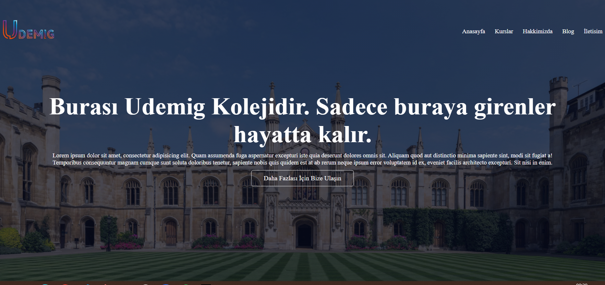
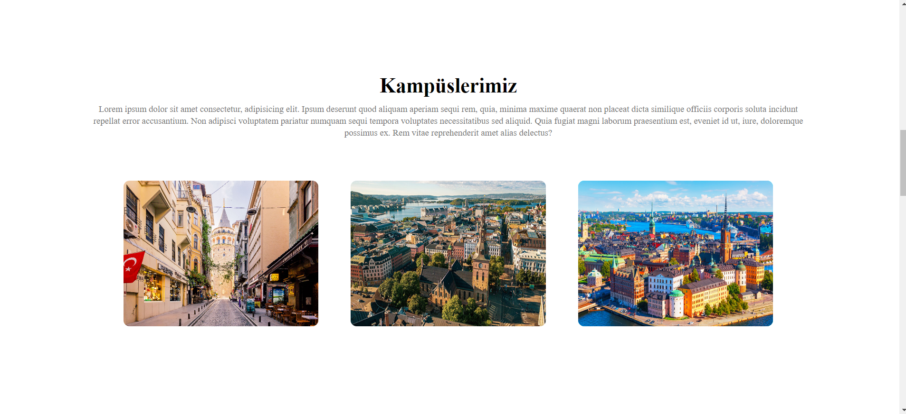

# Udemig-Okul-Projesi
Resposive bir website geliştirildi.Bu depo, kurumsal bir okul ve kurs projesini geliştirmek amacıyla oluşturulmuştur. Proje, bir okul veya kurs yönetimi için temel işlevselliği sağlamak, öğrenci ve öğretmen yönetimini kolaylaştırmak ve eğitim sürecini daha etkili hale getirmek üzerine odaklanmaktadır.

# Özellikler
Website kampüsler,birimler,öğrenci deneyimleri ve iletişim bilgilerini içerir.

Bu website aşağıdaki şekilde de geliştirilebilir.
- **Kullanıcı Yönetimi**: Öğrenci, öğretmen ve yönetici rolleri için kullanıcı hesapları oluşturabilir ve yönetebilirsiniz.
- **Ders Programı**: Okulun veya kursun ders programını oluşturmak ve güncellemek için bir araç sunar.
- **Sınav ve Değerlendirme**: Öğrencilerin performansını izlemek ve sınav sonuçlarını yönetmek için bir değerlendirme sistemi içerir.
- **İletişim Araçları**: Öğrencilerle, öğretmenlerle ve velilerle etkileşimi kolaylaştırmak için bir iletişim platformu sağlar.
- **Raporlama**: Okulun veya kursun genel performansını izlemek için raporlama araçları içerir.

# Kullanılar Teknolojiler
-HTML
-CSS

# Ekran Görüntüleri

# GIF

